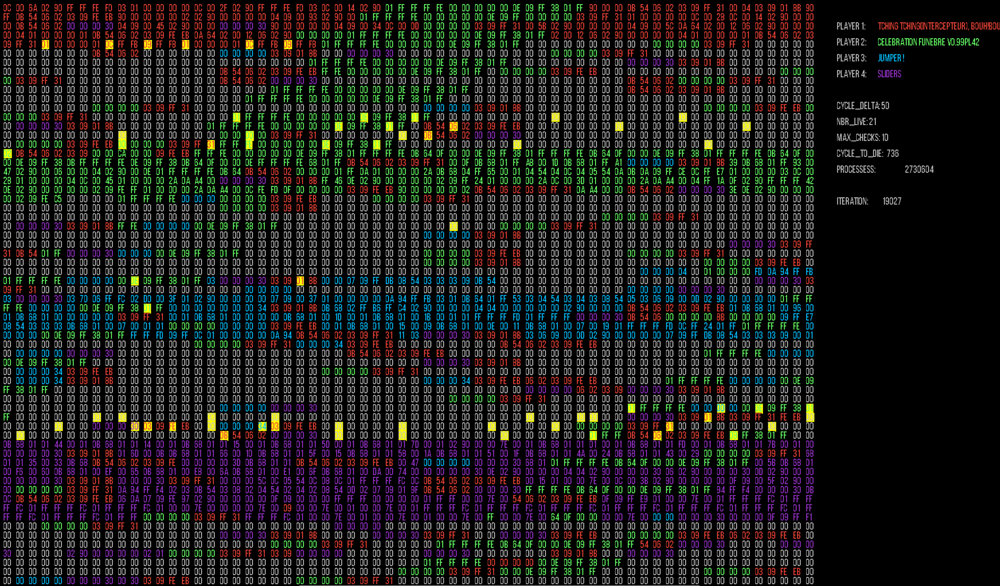

# Corewar
It is the final project of the algorithmic branch. The main idea is to represent famous programming game "Core War".
If you want more details - check the [pdf](readmeResources/corewar.en.pdf). 

# Parts:
- Assembler translate commands from assembly language to bytocode understandable to VM.
- Virtual machine runs byte code commands and announce the winner.
- Visualization display the game.

# Usage

#### `Assembler`

```
Usage: ./asm "source_file.s"
```

#### `Virtual machine`
>You can get champions in champs dir. You have to compile them using assembler part.

```
Usage: ./corewar [-dump N -v N -visual [ip]] <[-n number] champion1.cor> <...>
    (-dump | -d) N      : Dumps memory after N cycles then exits
    -v N                : Verbosity levels, can be added together to enable several
                          - 0 : Show only essentials
                          - 1 : Show lives
                          - 2 : Show cycles
                          - 4 : Show operations (Params are NOT litteral ...)
                          - 8 : Leaks checking every 500 iterations
    -visual [ip | link] : Visualization corewar, socket connection
    -n N                : Set player number
```

#### `Visualization`

```
./visualization/visualization &
Press Enter, then start VM with -visual [without ip is localhost]
ESC to exit program.
SPACE to pause/unpause.
```

# Example game


